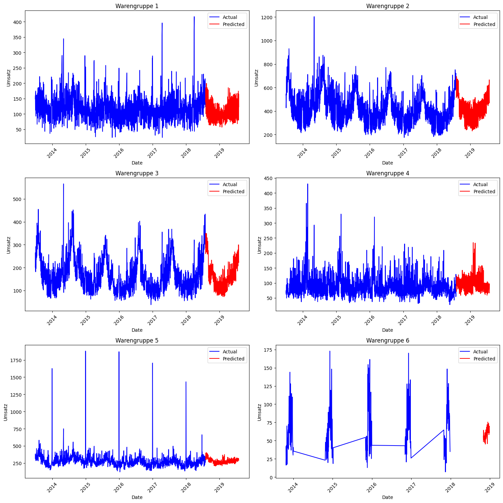

# Model Definition and Evaluation
[Bakery sales prediction LSTM source code](bakery_lstm_6_0.ipynb)

## Model Selection
LSTM (Long Short-Term Memory) 

## Feature Engineering
**One-hot encode** to represent categorical variables
```python
warengruppe_dummies = pd.get_dummies(data['Warengruppe'], prefix='Warengruppe')
day_dummies = pd.get_dummies(data['DayOfWeek'], prefix='Day')
month_dummies = pd.get_dummies(data['Month'], prefix='Month')
```

## Hyperparameter Tuning
- **LSTM layer**:
Units: `64` (the number of units or neurons in the LSTM layer)
- **Activation function**: 
'relu' (the activation function used in the LSTM layer)
- **Input shape**: 
`(X_train_seq.shape[1], X_train_seq.shape[2])` (the shape of the input data)
- **Dropout layer**:
Rate: `0.3` (the fraction of input units to drop)
- **Dense layer**:
Units: `1` (the number of units or neurons in the output layer)

## Implementation
- **Learning rate scheduler** function to dynamically adjust the learning rate during the training process
```python
def lr_schedule(epoch, lr):
    initial_lr = 0.01  # Start with this learning rate
    decay_rate = 0.1  # Decay rate
    decay_steps = 10  # Epochs after which to decay
    return initial_lr * np.exp(-decay_rate * (epoch / decay_steps))
```
- Training
```python
history = model.fit(
    X_train_seq, y_train_seq, 
    epochs=50, # default 150
    batch_size=32, 
    validation_data=(X_val_seq, y_val_seq), 
    callbacks=[early_stopping, model_checkpoint, lr_scheduler])
```

## Evaluation Metrics
**MAPE** by sales items (Warengruppe):
```
Warengruppe 2: 13.71%
Warengruppe 5: 15.34%
Warengruppe 3: 18.85%
Warengruppe 1: 20.19%
Warengruppe 4: 27.35%
Warengruppe 6: 51.54%
```

